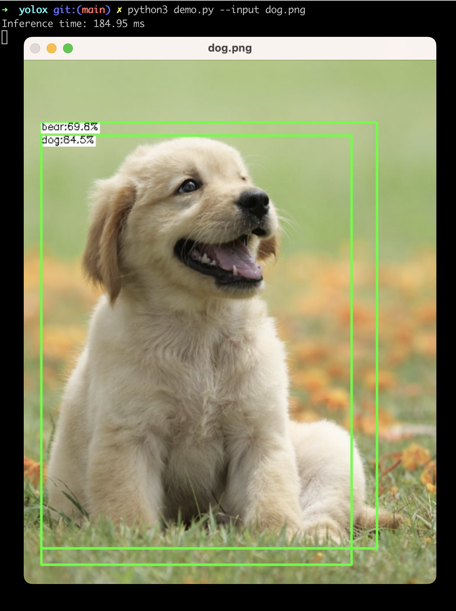

# AnimalDetection

## Setup guide
1. Follow the [Install OpenCV on M1](./M1OpenCVInstall.md)

2. Start the detector in terminal. Note: inside yolox directory
    ```
    python3 demo.py --input dog.png
    ```
3. Terminate detector in terminal

    <button name="shift">control</button> + <button name="shift">d</button>

## Result


## flask
install
```
pip install flask
```

run
```
export FLASK_APP=index
export FLASK_ENV=development
flask run
```

open browser
```
http://127.0.0.1:5000/
```