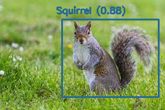

# AnimalDetection
Animal Detection is the web application where the user can upload the image of animal and detect which animal it is. 
※ It detects only Bird, Cat, Dog, Monkey, Squirrel for now.

## Tech stack
* YOLOv8
* OpenCV
* Python, Flask
* Render

## Setup guide
1. Install OpenCV
   Follow the [Install OpenCV on M1](./M1OpenCVInstall.md)

2. Start the detector in terminal. Note: inside yolov8 directory
    ```
    python3 demo.py --img dog.png
    ```
3. Terminate detector in terminal

    <button name="shift">control</button> + <button name="shift">c</button>

## Result


## Running on the browser
install
```
pip install flask
```

run
```
export FLASK_APP=index
export FLASK_ENV=development
flask run
```

open browser
```
http://127.0.0.1:5000/
```

## OpenCV
OpenCV is a library for image processing. In this project, we implemented YOLO algorithm on OpenCV.

## YOLOv8
* YOLO(You Only Look Once): object detection models used for real-time object detection.
* YOLOv8: launched on Jan 10th, 2023 from Ultralytics
* [Pre-trained models](https://github.com/ultralytics/assets/releases): models trained on the [COCO detection dataset](https://cocodataset.org/#home). This dataset includes 80 classes with 330k images.

## Train custom dataset
In this project, we trained custom dataset instead of using pre-trained model.

1. Install YOLOv8 via the ultralytics
   ```
   pip3 install ultralytics
   ```

2. Install PyTorch
   ```
   pip3 install torch torchvision torchaudio   
   ```

3. Create your own Dataset or find the collection on Roboflow
   In this project, I used [the dataset](https://universe.roboflow.com/new-workspace-x0ijl/animal-detection-dy7jy) from the collection

   ```
   ※ What Roboflow does
   - Collect data
   - Label data
   - Split data(train, test, val)
   - Create config files
   ```

4. Train the model (I used GPU)
   - Build a new model from scratch: `yolo detect train data=data.yaml model=yolov8n.yaml epochs=100 imgsz=640`
   - Train a new model from pretrained model: `yolo detect train data=data.yaml model=yolov8n.pt epochs=100 imgsz=640`
   - Build a new model and transfer the pretrained model to it: `yolo detect train data=data.yaml model=yolov8n.yaml pretrained=yolov8n.pt epochs=100 imgsz=640`
  
## Use the custom model
```
yolo detect predict model=/runs/detect/train/weights/best.pt source=animal.jpg save=True
```

※ When you want to use a pretrained 
```
yolo detect predict model=yolov8n.pt source=animal.jpg save=True
```

## Export the model
```
yolo export model=best.pt opset=12 format=onnx
```

## LIVE
https://animal-detection.onrender.com/
